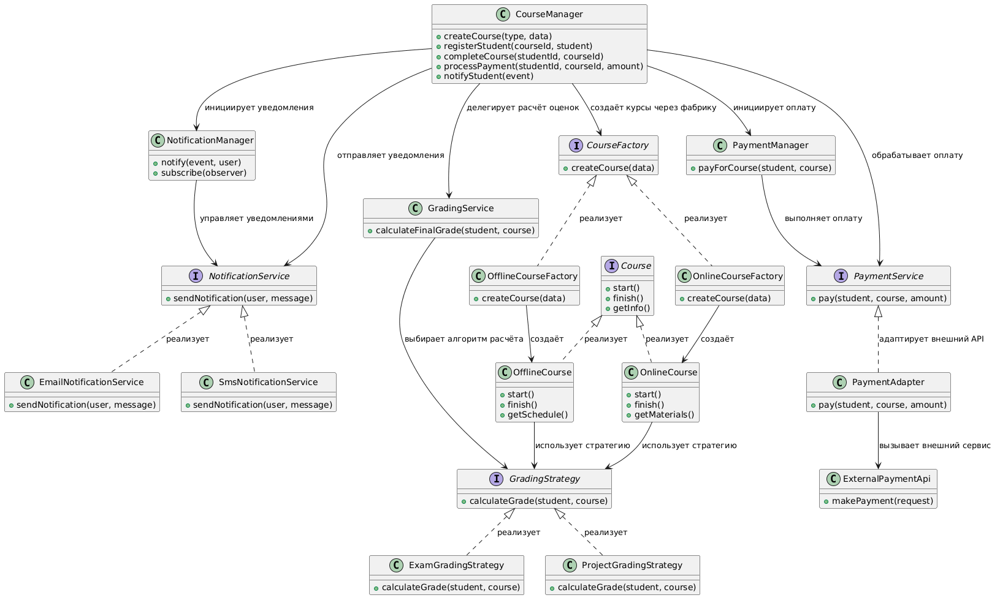

# Сессионное задание по дисциплине "Архитектура сервисов и приложений

## Задание 1

### Решение

Для того, чтобы предложить более подходящие решения, для начала необходимо проанализировать текущее решение и его проблемы.

Исходя из условия задания, можно явно выделить следующие ключевые проблемы:

1. Нарушение принципа единственности ответственности (SRP) - в god-object классе CourseManager содержится и бизнес-логика, создание объектов, отправка уведомлений и интеграции с внешними сервисами.

2. Нарушения принципа открытости/закрытости (OCP) - при добавлении нового типа курса необходимо изменять существующий код. К этому же относится создание курсов через прямые вызовы конструкторов. А также жёсткая фиксация алгоритма расчёта оценки в одном методе.

3. Нарушен принцип инверсии зависимостей (DIP) - основной класс зависит от конкретных API интеграций, конкретных классов внешнего API, вызывает их напрямую.

4. Нарушение принципа DRY (Don’t Repeat Yourself) - похожие действия выполняются в разных методах CourseManager.

Хочу обратить внимание, что из списка выше одна и та же проблема может требовать сразу несколько решений в разных местах кода. Например, нарушение OCP при добавлении нового типа курса может быть решена с помощью паттерна *FactoryMethod*, а жёсткая фиксация алгоритма этого же принципа - с помощью *Strategy*.

Ниже в таблице приведено более детальное сопоставление конкретных проблем системы, способов их устранения и соответствующих паттернов проектирования:

| Проблема | Решение | Используемый паттерн | Обоснование |
|----------|--------|----------------------|-------------|
| Создание курсов реализовано через условные конструкции if/else и прямые вызовы конструкторов | Вынести создание объектов курсов в отдельную фабрику, работающую через абстракции | Factory Method | Убирает зависимость от конкретных классов и позволяет добавлять новые типы курсов без изменения существующего кода |
| Жестко зафиксированный алгоритм оценки | Вынести алгоритмы оценки в отдельные классы, которые реализуют общий интерфейс | Strategy | Позволяет независимо изменять и расширять алгоритмы расчета оценок для разных типов курсов без изменения основной бизнес-логики |
| Отправка уведомлений встроена в основную бизнес-логику | Ввести событийную модель, где сервис уведомлений подписывается на события системы | Observer | Бизнес-логика перестает зависеть от конкретных каналов уведомлений. Добавление новых способов уведомления не требует изменения существующего кода |
| Работа с платежной системой реализована через прямые вызовы конкретного внешнего API | Создать промежуточный интерфейс оплаты и адаптер для внешнего платежного сервиса | Adapter | Изолирует бизнес-логику от конкретной реализации внешнего API и позволяет заменить платежную систему без изменений основной логики |
| В классе CourseManager сосредоточены разнородные обязанности: создание курсов, хранение данных, расчет оценок, уведомления и работа с оплатой | Разделить систему на разные сервисы | Facade | Уменьшает связанность системы и устраняет проблему god-object |
| В разных методах CourseManager присутствует дублирование логики | Вынести общий алгоритм обработки в базовый шаблон с переопределяемыми шагами | Template Method | Позволяет избежать дублирования кода, сохранив возможность изменения отдельных этапов алгоритма в дочерних классах |

Хотел бы также отметить, что в нашем курсе в разделе порождающих паттернов не был указан паттерн *Simple Factory*, хотя он идеально вписывается как решение проблемы с созданием курсов.

Исходя из определённых паттернов выше, исходный основной класс *CourseManager* можно разделить на следующие классы и интерфейсы:

| Тип | Название | Зависит от | Ответственность / описание | Основные методы |
|-----|----------|------------|----------------------------|------------------|
| Класс | CourseManager | CourseFactory, CourseService, GradingService, NotificationService, PaymentService | Центральный координатор системы. Управляет жизненным циклом обучения: созданием курсов, регистрацией студентов, запуском и завершением обучения, а также координацией оплаты, оценок и уведомлений через специализированные сервисы. | createCourse(type, data), registerStudent(courseId, student), completeCourse(studentId, courseId), processPayment(studentId, courseId), notifyStudent(event) |
| Интерфейс | CourseFactory | — | Контракт создания курсов. Инкапсулирует логику создания и скрывает конкретные реализации от клиентского кода | createCourse(data) |
| Класс | OnlineCourseFactory | OnlineCourse | Фабрика онлайн-курсов, создающая и настраивающая курсы онлайн-формата | createCourse(data) |
| Класс | OfflineCourseFactory | OfflineCourse | Фабрика офлайн-курсов, отвечающая за создание курсов с очным обучением | createCourse(data) |
| Интерфейс | Course | — | Базовый контракт курса, описывающий общий жизненный цикл и поведение всех типов курсов | start(), finish(), getInfo() |
| Класс | OnlineCourse | GradingStrategy | Реализация онлайн-курса с цифровыми материалами и удалённым обучением | start(), finish(), getMaterials() |
| Класс | OfflineCourse | GradingStrategy | Реализация офлайн-курса с очным форматом и расписанием занятий | start(), finish(), getSchedule() |
| Интерфейс | GradingStrategy | — | Стратегия расчёта итоговой оценки студента | calculateGrade(student, course) |
| Класс | ExamGradingStrategy | — | Оценка на основе экзаменационных результатов | calculateGrade(student, course) |
| Класс | ProjectGradingStrategy | — | Оценка на основе проектной работы | calculateGrade(student, course) |
| Интерфейс | NotificationService | — | Унифицированный интерфейс уведомлений через разные каналы | sendNotification(user, message) |
| Класс | EmailNotificationService | — | Уведомления через email | sendNotification(user, message) |
| Класс | SmsNotificationService | — | Уведомления через SMS | sendNotification(user, message) |
| Интерфейс | PaymentService | — | Абстракция платёжной системы | pay(student, course, amount) |
| Класс | PaymentAdapter | ExternalPaymentApi | Адаптер для интеграции с внешней платёжной системой | pay(student, course, amount) |
| Класс | ExternalPaymentApi | — | Внешний платёжный сервис | makePayment(request) |
| Класс | CourseService | CourseFactory, Course | Сервис управления курсами: создание, хранение и получение данных о курсах | createCourse(type, data), getCourse(id) |
| Класс | GradingService | GradingStrategy | Сервис расчёта итоговых оценок с использованием стратегий | calculateFinalGrade(student, course) |
| Класс | NotificationManager | NotificationService | Управляет отправкой уведомлений и координирует различные каналы | notify(event, user), subscribe(observer) |
| Класс | PaymentManager | PaymentService | Управляет процессом оплаты курсов и взаимодействием с платёжной системой | payForCourse(student, course) |

На основе предложенных к созданию и реализации классов выше была построена UML-диаграмма классов обновлённой системы:

#### Вывод:
В результате работы была проанализирована исходная система и выявлены нарушения принципов SOLID, связанные с перегруженностью CourseManager, жесткой связанностью и невозможностью масштабирования.

Предложена новая архитектура с разделением ответственности на специализированные классы и применением паттернов Factory Method, Strategy, Observer, Adapter, Facade и Template Method.

В результате удалось устранить дублирование кода, решить выявленные архитектурные проблемы и повысить структурированность системы. Также представлена UML-диаграмма обновлённой архитектуры системы.
